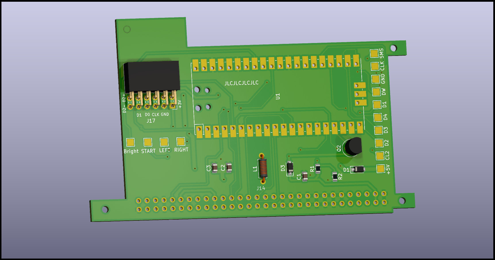

## Pico GG LCD

RP2040-based Game Gear screen replacement kit.
Even a cheapo modern LCD has much, much, much better contrast ratio than the OG screen.

## How Game Gear video signals work

The Game Gear ASIC generates digital video signals that the LCD drivers in the LCD ribbon use to drive the actual display segments.

In NTSC mode, i.e, when test pad T10 is connected to +5V, the timings of the signals from the ASIC closely resemble what one would expect from a console like the Master System. All screen replacement kits run the Game Gear in this mode, as far as I'm aware. 

The communication protocol used between the ASIC and the LCD drivers in this mode is [well documented](https://www.retrosix.wiki/va0va1-lcd-interface-game-gear) and essentially boils down to:

- 32 MHz pixel clock (same as the main system clock)
- 4 bit data bus carrying one channel of color data at a time
- VSync signal
- HSync signal

## How the RP2040 captures GG video

One of the PIOs is takes alongside three DMA channels with building a live framebuffer in RAM with the image data the GG is sending out.

Three PIO SMs are used in the following manner:

- SM0 detects when a frame starts and triggers an IRQ.
- SM1 detects the IRQ from SM0 and starts detecting HSync pulses. It triggers an IRQ when it does.
- SM2 detects the IRQ from SM1 and proceeds to capture pixel data and push it out to the RX FIFO.

One of the DMA channels then takes the 12bpp pixel data from the PIO RX FIFO and saves it into RAM.

Finally, one of the CPU cores upscales the image and sends it out to the LCD.

